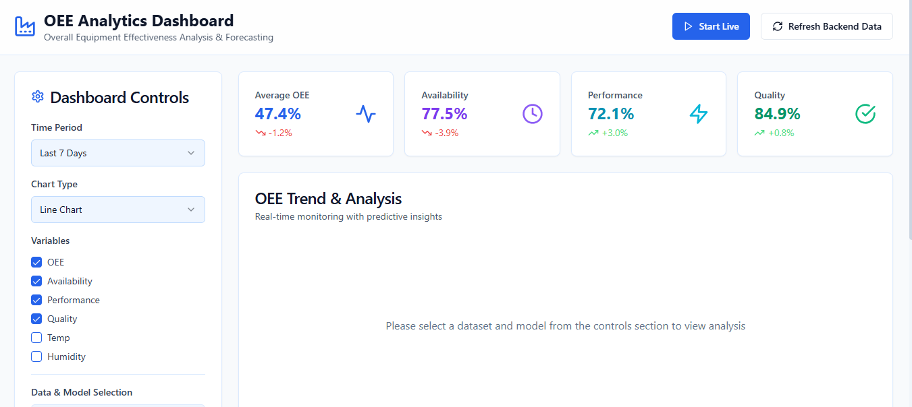

# OEE360

OEE360 is a manufacturing analytics dashboard for monitoring Overall Equipment Effectiveness (OEE), availability, performance, and quality across time-based production data. The project combines real-time KPI visualization, dataset/model selection, and forecasting experiments in a single Next.js application.

Project by: Adam El Madani & Mohammed Amine Hssaine
Supervised by: Tawfik Masrour



## Why this project matters

Manufacturing teams need fast visibility into how equipment is performing. OEE is the standard KPI used to understand whether machines are running effectively, and OEE360 helps teams answer questions like:

- Are we losing time to downtime or setup delays?
- Is output performance consistent across shifts?
- Which production periods show quality degradation?
- How accurately can we forecast the next hours or days of OEE performance?

This dashboard turns raw production signals into a clear operational story with charts, values, and forecast comparisons.

## Features

- OEE dashboard with live and historical KPI monitoring
- Trend analysis for OEE, availability, performance, and quality
- Correlation insights between OEE drivers and operational variables
- Forecast generation using multiple baseline methods:
  - seasonal
  - smoothing
  - momentum
- CSV and JSON dataset upload support
- Model selection and analysis workflow
- Seeded demo datasets and built-in model definitions
- Local persistence using the filesystem under the project data directory
- Responsive UI built with Next.js + Tailwind + shadcn/ui

## Tech stack

- Next.js 14
- React 18
- TypeScript
- Tailwind CSS
- Recharts
- shadcn/ui component primitives
- Papa Parse for CSV handling

## Architecture overview

The application follows a simple local-first architecture:

- Frontend: dashboard and analysis pages under `app/`
- API layer: Next.js route handlers under `app/api/`
- Shared logic: time-series utilities and simulation helpers in `lib/`
- UI building blocks: reusable components under `components/`
- Data persistence: uploaded datasets and model metadata are stored under `data/`

## Project structure

```text
OEE360/
├── app/
│   ├── api/
│   │   ├── analytics/
│   │   ├── datasets/
│   │   ├── forecast/
│   │   ├── models/
│   │   └── simulation/
│   ├── analyze/
│   ├── layout.tsx
│   └── page.tsx
├── components/
│   ├── ui/
│   ├── DataModelSelector.tsx
│   └── DynamicValue.tsx
├── data/
│   ├── datasets/
│   └── models/
├── lib/
│   ├── api.ts
│   ├── oee-simulation.ts
│   ├── time-series.ts
│   └── utils.ts
├── hooks/
├── public/
├── styles/
├── components.json
├── next.config.mjs
├── package.json
├── pnpm-lock.yaml
├── postcss.config.cjs
├── tailwind.config.js
├── tsconfig.json
├── LICENSE
├── README.md
└── .gitignore
```

## Main capabilities

### Dashboard

The main dashboard provides a factory-style overview of KPIs with interactive controls for:

- selecting time windows (24h / 7d / 30d)
- enabling live simulation updates
- switching chart types
- comparing multiple OEE-related variables

### Forecasting

The app includes simple but practical forecasting routines for time-series OEE data. Forecast results include:

- future OEE projections
- forecast confidence intervals
- selection of the best-performing method for the chosen model
- holdout evaluation metrics such as MAE, RMSE, and sMAPE

### Data ingestion

Users can upload their own production datasets as CSV or JSON files. The backend validates the file types and stores them locally, enabling the dashboard to work with real operational data rather than only synthetic examples.

## Built-in demo behavior

When the app starts, it seeds the `data/datasets` and `data/models` folders automatically if they are empty. This ensures the dashboard has valid example data and model definitions on first run without any manual setup.

The simulation layer generates realistic hourly OEE data with:

- shift-based performance patterns
- day/week factors
- temperature and humidity variation
- energy price effects
- fatigue and downtime signals

## API overview

The application exposes local API routes for analytics and forecasting.

### Dataset APIs

- `GET /api/datasets` — list stored datasets
- `POST /api/datasets` — upload a CSV or JSON dataset
- `GET /api/datasets?id=<name>` — fetch a single dataset

### Model APIs

- `GET /api/models` — list stored model metadata
- `POST /api/models` — upload a JSON model definition

### Analytics APIs

- `POST /api/analytics` — run a basic analytics pass on a dataset/model pair

### Forecast APIs

- `POST /api/forecast` — generate one-step or multi-hour forecasts and evaluation metrics

### Simulation API

- `GET /api/simulation/oee?hours=168` — generate realistic simulated OEE data

## Quick start

### Requirements

- Node.js 18 or newer
- pnpm

### Install dependencies

```bash
npm install -g pnpm
pnpm install
```

### Start the development server

```bash
pnpm run dev
```

Then open:

```text
http://localhost:3000
```

## Recommended dataset format

CSV data is expected to include time-based fields and OEE-related KPIs, such as:

```csv
timestamp,OEE,availability,performance,quality,temp,humidity,energy_price,fatigue,downtime
2024-01-01T00:00:00Z,0.82,0.9,0.91,0.99,21.4,48.2,0.11,0.25,0.0
```

JSON data can be a list of objects with the same fields.

## License

This project is licensed under the MIT License. See the [LICENSE](LICENSE) file for details.
